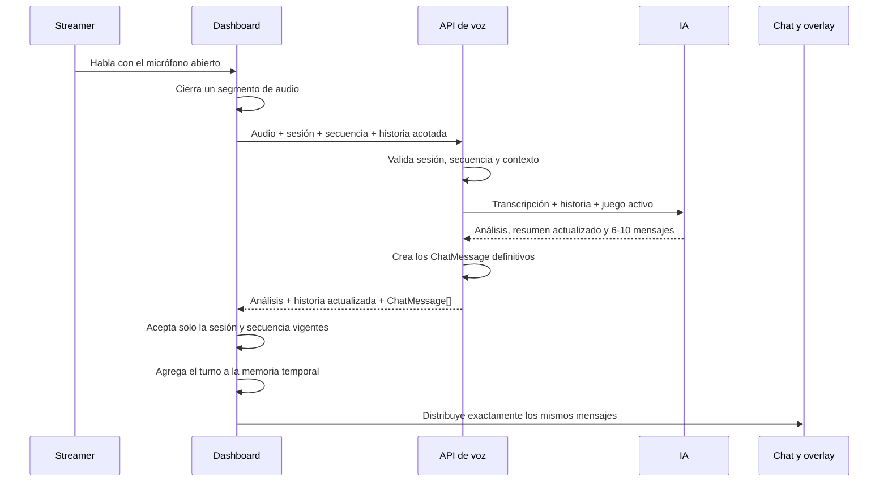

# Escalar la voz: memoria narrativa durante el micrófono abierto

## Objetivo

Convertir la función de micrófono en una conversación continua y coherente. Mientras el micrófono esté abierto, el chat debe recordar:

- Lo que acaba de decir el streamer.
- Las respuestas exactas que generó el chat.
- El tema activo y los cambios de tema.
- Si el streamer está preguntando, reaccionando, sorprendido, confundido o respondiendo a un mensaje previo.
- Los momentos importantes que forman la historia breve del directo.

Esta memoria será temporal. Se eliminará al cerrar el micrófono, pausar o detener el directo. El chat automático conservará su estructura y flujo actuales.

## Resultado esperado

La interacción debe sentirse como una conversación entre el streamer y varias personas que recuerdan lo que ocurrió hace unos momentos.

### Ejemplo principal

1. El streamer pregunta: **“¿Cuál les gusta más, GTA San Andreas o GTA V?”**
2. El chat genera entre 6 y 10 respuestas relacionadas con la comparación.
3. Una respuesta dice: **“el chat se va a encender con esa comparación”**.
4. El streamer pregunta sorprendido: **“¿Por qué el chat se encendería, qué dije o qué?”**
5. El sistema reconoce que está respondiendo al mensaje anterior y mantiene la comparación entre ambos juegos.
6. El chat explica la reacción con respuestas como:
   - “Porque acabas de dividir al chat en dos bandos.”
   - “San Andreas contra GTA V siempre levanta debate.”
   - “No dijiste nada malo, solo tocaste un tema peligroso 😂.”
7. Si después pregunta por Minecraft, la conversación cambia de tema y deja de arrastrar GTA sin motivo.

## Decisiones principales

| Área | Decisión |
|---|---|
| Duración de la memoria | Existe únicamente mientras el micrófono está abierto. |
| Persistencia | No se guarda en base de datos, `localStorage` ni entre sesiones. |
| Fuente de la memoria | El dashboard mantiene el estado temporal y lo envía en cada segmento de voz. |
| Contenido recordado | Preguntas del streamer, tema, intención, emoción, relación con el turno anterior y respuestas exactas del chat. |
| Llamadas de IA | Una sola llamada por segmento para analizar y generar respuestas. |
| Cantidad de mensajes | Entre 6 y 10 por segmento válido. |
| Chat normal | Continúa funcionando con el flujo actual y no entra en la memoria de voz. |
| Respuestas atrasadas | Se descartan usando el identificador de sesión y la secuencia del segmento. |

## Alcance funcional

### Incluido

- Reconocer referencias a respuestas anteriores del chat.
- Mantener comparaciones con varios elementos, por ejemplo, “GTA San Andreas contra GTA V”.
- Entender preguntas de seguimiento aunque no repitan el tema.
- Detectar cambios explícitos de tema.
- Adaptar el tono a sorpresa, curiosidad, diversión, confusión, emoción o frustración.
- Mantener una historia breve del directo mediante un resumen acumulado.
- Usar en el siguiente turno los mismos mensajes que se enviaron al dashboard y al overlay.
- Limitar la memoria para controlar latencia, tamaño de petición y costo.

### Fuera de alcance

- Memoria permanente entre directos.
- Entrenar perfiles individuales de espectadores.
- Hacer que el chat automático ajeno al micrófono modifique la historia de voz.
- Añadir una segunda llamada de IA para resumir.
- Convertir las respuestas del chat a audio.

## Modelo de memoria temporal

El contexto actual solo conserva transcripciones recientes. Debe ampliarse para incluir también las respuestas que el usuario puede mencionar después.

```ts
type VoiceConversationRelation =
  | 'new_topic'
  | 'continuation'
  | 'follow_up'
  | 'reply_to_chat'
  | 'topic_shift'
  | 'none'

type VoiceEmotion =
  | 'neutral'
  | 'curious'
  | 'surprised'
  | 'amused'
  | 'confused'
  | 'excited'
  | 'frustrated'

interface VoiceStoryMessage {
  id: string
  username: string
  content: string
}

interface VoiceStoryTurn {
  sequence: number
  transcript: string
  topic: string | null
  intent: VoiceIntent
  relation: VoiceConversationRelation
  emotion: VoiceEmotion
  referencedMessageId: string | null
  chatMessages: VoiceStoryMessage[]
  beat: string
  timestamp: number
}

interface VoiceStoryState {
  summary: string
  activeTopic: string | null
  previousTopics: string[]
  recentTurns: VoiceStoryTurn[]
}
```

### Límites recomendados

- Conservar los últimos **6 turnos de voz**.
- Conservar como máximo **10 mensajes del chat por turno**.
- Limitar el resumen acumulado a **800 caracteres**.
- Conservar como máximo **4 temas anteriores**.
- Limitar el cuerpo completo de contexto a aproximadamente **24 KB**.
- Recortar texto en el servidor aunque el cliente ya lo haya limitado.

Estos límites permiten recordar una conversación corta sin enviar todo el directo en cada petición.

## Ciclo de vida

La sesión narrativa comienza cuando el micrófono cambia de apagado a encendido.

La memoria se elimina cuando ocurre cualquiera de estos eventos:

- El usuario apaga el micrófono.
- El directo se pausa.
- El directo se detiene.
- Se inicia un nuevo directo.
- El dashboard se desmonta o recarga.
- La sesión de usuario deja de ser válida.

Si el usuario apaga y vuelve a encender el micrófono dentro del mismo directo, comienza una historia nueva y vacía. Esto evita que una conversación anterior reaparezca cuando el streamer espera empezar desde cero.

## Flujo completo por segmento



### Orden de actualización

1. El dashboard toma una copia inmutable de la historia actual.
2. Envía esa copia junto con el segmento.
3. El servidor transcribe, analiza y genera el lote completo.
4. El servidor crea una sola vez los objetos `ChatMessage` con autor, orden e identificador.
5. El dashboard verifica `voiceSessionId` y `segmentSequence`.
6. Solo una respuesta vigente y válida puede modificar la historia.
7. El nuevo turno guarda los mensajes exactos devueltos por el servidor.
8. El mismo lote se distribuye gradualmente al dashboard y al overlay.

Una respuesta fallida, vacía, marcada como ruido o perteneciente a una sesión anterior no modifica la memoria.

## Contrato de la petición

La petición de voz debe separar el juego activo de la historia hablada.

```ts
interface VoiceReactRequest {
  audio: Blob
  voiceSessionId: string
  segmentSequence: number
  activeGame: string | null
  story: VoiceStoryState
}
```

El servidor debe tratar `story` como entrada no confiable: validar tipos, longitudes, número de turnos y referencias antes de construir el prompt.

Durante una transición gradual, `story` puede ser opcional. Si no existe o es inválido, la API debe usar una historia vacía y conservar el comportamiento de voz actual.

## Contrato de la respuesta de IA

El análisis y la generación se mantienen en una sola llamada estructurada.

```ts
interface VoiceStoryAnalysis {
  topic: string | null
  intent: VoiceIntent
  relation: VoiceConversationRelation
  emotion: VoiceEmotion
  referencedMessageId: string | null
  confidence: number
  usesPreviousTopic: boolean
  storyBeat: string
  storySummary: string
  messages: string[]
}
```

### Validaciones posteriores

- `messages` debe contener entre 6 y 10 elementos cuando la frase sea válida.
- `messages` debe estar vacío cuando `intent` o `relation` sea `none` por ruido o frase incompleta.
- `referencedMessageId` debe existir dentro de los mensajes enviados en la historia. Si no existe, se convierte en `null`.
- `storySummary` y `storyBeat` se recortan a sus límites.
- `confidence` se restringe al rango de 0 a 1.
- Los valores desconocidos de intención, relación o emoción vuelven a un valor seguro.

## Reglas de comprensión

La IA debe aplicar esta prioridad:

1. **Nuevo tema explícito.** Si el streamer nombra otro juego, persona o asunto, ese tema se vuelve activo.
2. **Respuesta a un mensaje del chat.** Detectar citas, paráfrasis y referencias semánticas como “¿por qué se encendería?”.
3. **Seguimiento del tema activo.** Resolver expresiones como “¿y cuál prefieren?” o “¿por qué?”.
4. **Acción del juego activo.** Usar el juego activo cuando la frase habla claramente de jugar, construir, morir, conseguir objetos o avanzar.
5. **Tema del directo.** Usarlo solamente cuando la frase menciona el stream, el chat, la audiencia o el directo.
6. **Ruido o frase incompleta.** No generar mensajes ni modificar la historia.

### Reglas para referencias al chat

- Comparar la nueva transcripción con el contenido de los mensajes recientes.
- Permitir coincidencias de significado, no solo citas literales.
- Dar prioridad a mensajes del último turno.
- Usar `referencedMessageId` cuando la referencia sea suficientemente clara.
- Si hay duda, conservar el tema activo sin afirmar que se respondió a un mensaje concreto.

### Reglas para cambios de tema

- Un tema nuevo reemplaza `activeTopic`.
- El tema anterior pasa a `previousTopics`.
- La respuesta nueva no debe mezclar el tema anterior salvo que el streamer lo compare o lo mencione.
- Volver a un tema previo debe sentirse como una continuación: “volviendo a lo de GTA…”, sin inventar hechos que no aparecieron en la conversación.

## Construcción de respuestas más naturales

Cada lote debe sentirse como varias personas reaccionando al mismo momento, con diferencias de opinión y energía.

Distribución recomendada para un lote de 6 a 10 mensajes:

- Entre 4 y 7 respuestas directamente relacionadas con la pregunta o reacción.
- Entre 1 y 2 reacciones breves que aporten ritmo.
- Como máximo 1 referencia a un momento previo o al estado del chat.

Reglas adicionales:

- No repetir literalmente la transcripción del streamer.
- No explicar toda la historia en cada mensaje.
- No hacer que todos los usuarios opinen igual.
- Mantener los mensajes cortos y propios de un chat en vivo.
- Responder al tono detectado sin exagerarlo.
- Si el usuario está confundido, aclarar el origen de la reacción.
- Si responde a una broma, continuarla durante pocos mensajes y volver al tema.
- No inventar mecánicas, datos concretos o acontecimientos que no están en el contexto.
- No mencionar el streaming salvo que el usuario lo mencione o esté reaccionando explícitamente al chat.

## Resumen narrativo acumulado

Además de los turnos recientes, la respuesta de IA genera un resumen corto de los hechos relevantes. Este resumen reemplaza al anterior y no requiere una segunda llamada.

Ejemplo:

> El streamer comparó GTA San Andreas con GTA V. El chat quedó dividido y una persona dijo que el chat se encendería. El streamer reaccionó sorprendido y pidió una explicación.

El resumen debe guardar hechos, temas y callbacks útiles. No debe guardar cada mensaje ni interpretar estados personales sensibles.

## Separación del chat normal

El sistema actual de mensajes automáticos debe seguir funcionando de forma independiente.

- Solo los lotes originados por el micrófono entran en `VoiceStoryState`.
- Los mensajes automáticos, waves y mensajes manuales no cambian la historia de voz.
- La frecuencia habitual del chat no depende de que exista una historia.
- El transporte actual por SSE permanece activo.
- El dashboard y el overlay reciben el mismo `ChatMessage`, con el mismo identificador, autor, contenido y orden.
- La deduplicación actual por identificador se conserva.

## Plan de implementación

### Fase 1: modelo y operaciones puras

Crear `src/lib/voiceStory.ts` con funciones pequeñas y comprobables:

- `createEmptyVoiceStory()`.
- `sanitizeVoiceStory(input)`.
- `appendVoiceStoryTurn(state, turn)`.
- `clearVoiceStory()`.
- `isKnownReferencedMessage(state, messageId)`.
- Recorte de turnos, temas, resumen y contenido.

Actualizar `src/utils/types.ts` con los tipos nuevos. Mantener temporalmente `VoiceTurn` y `recentTurns` para compatibilidad durante la transición.

**Resultado:** existe una única forma de crear, validar, ampliar y limpiar la memoria.

### Fase 2: ciclo de vida en el dashboard

Actualizar `src/components/StreamerDashboard.tsx`:

- Reemplazar el cambio directo de `micEnabled` por manejadores explícitos de apertura y cierre.
- Crear un `voiceSessionId` nuevo al abrir el micrófono.
- Reiniciar la secuencia y `VoiceStoryState` al abrirlo.
- Limpiar la historia al cerrar, pausar, detener o desmontar.
- Adjuntar una copia acotada de la historia a cada petición.
- Agregar un turno únicamente después de aceptar una respuesta vigente.
- Guardar en el turno los `chatMessages` definitivos que llegaron desde la API.

**Resultado:** la memoria existe durante el uso real del micrófono y desaparece de forma predecible.

### Fase 3: API y prompt conversacional

Actualizar `src/pages/api/voice-react.ts` y `src/lib/ai/serviceManager.ts`:

- Aceptar y validar `story`.
- Incluir resumen, tema activo, turnos y mensajes recientes en el prompt.
- Clasificar relación y emoción.
- Resolver referencias a mensajes previos.
- Generar `storyBeat` y el resumen actualizado en la misma llamada.
- Mantener la regla de 6 a 10 mensajes.
- Convertir una referencia inválida en `null`.
- Devolver el análisis ampliado junto con los `ChatMessage` definitivos.

Regla central del prompt:

> Usa la historia solo para comprender la conversación. Responde a lo que el streamer acaba de decir. Si hace referencia a un mensaje anterior, conecta la respuesta con ese mensaje y con el tema que lo originó. Si cambia de tema, deja de arrastrar el anterior. No menciones el stream salvo que el streamer hable del stream o del chat.

**Resultado:** cada segmento comprende lo ocurrido antes sin añadir otra llamada de IA.

### Fase 4: entrega y observabilidad

- Mantener un solo segmento en procesamiento y como máximo uno pendiente.
- Entregar el primer mensaje pronto y espaciar los siguientes entre 600 y 1.200 ms.
- Preservar el lote completo aunque llegue otro segmento mientras se está mostrando.
- Mantener la deduplicación entre respuesta local y SSE.
- Descartar respuestas con una sesión o secuencia obsoleta.
- Añadir registros solo en desarrollo con:
  - Secuencia.
  - Tema.
  - Relación.
  - Emoción.
  - Identificador del mensaje referenciado.
  - Número de turnos recordados.
  - Número de mensajes generados y entregados.
- No imprimir transcripciones completas ni la historia en producción.

**Resultado:** la conversación se muestra completa, en orden y sin duplicados.

### Fase 5: compatibilidad y endurecimiento

- Permitir peticiones sin `story` durante la migración.
- Ante contexto inválido, usar una historia vacía en vez de detener la voz.
- Mantener el comportamiento actual si el proveedor devuelve el formato anterior.
- Si la IA falla, no agregar un turno incompleto.
- Si la transcripción es ruido, no actualizar resumen, tema ni mensajes.
- Medir el tamaño del contexto y la duración de la llamada en desarrollo.

**Resultado:** el despliegue puede hacerse por partes sin romper el flujo existente.

## Archivos previstos

| Archivo | Cambio |
|---|---|
| `src/utils/types.ts` | Añadir tipos de historia, relación, emoción, petición y respuesta. |
| `src/lib/voiceStory.ts` | Crear estado, validación, límites y actualización inmutable. |
| `src/components/StreamerDashboard.tsx` | Administrar la memoria durante el ciclo de vida del micrófono. |
| `src/pages/api/voice-react.ts` | Validar la historia, descartar respuestas obsoletas y devolver el turno completo. |
| `src/lib/ai/serviceManager.ts` | Ampliar el prompt y el resultado estructurado en una sola llamada. |
| `tests/voiceStory.test.mjs` | Probar el modelo de memoria sin depender de proveedores externos. |
| `testsprite_tests/TC_VOICE_conversation_memory.py` | Probar la experiencia completa con Playwright y respuestas controladas. |

## Estrategia de pruebas

### Pruebas del estado temporal

- Crear una historia vacía al abrir el micrófono.
- Agregar un turno con los mensajes exactos del chat.
- Conservar solamente los últimos 6 turnos.
- Recortar resumen, mensajes y temas a los límites establecidos.
- Cambiar de tema sin mezclar el anterior.
- Rechazar un `referencedMessageId` inexistente.
- No modificar la historia ante ruido, error o respuesta atrasada.
- Limpiar todo al cerrar y volver a abrir el micrófono.

### Pruebas de enrutamiento y generación

- “¿Cuál les gusta más, GTA San Andreas o GTA V?” crea una comparación con ambos juegos.
- “¿Por qué el chat se encendería?” se clasifica como `reply_to_chat` y referencia el mensaje correcto.
- “¿Y cuál tiene mejor historia?” continúa la comparación.
- “Ahora, ¿qué construyo en Minecraft?” cambia el tema a Minecraft y deja de mencionar GTA.
- “¿Cómo va el stream?” cambia al contexto del directo.
- Una frase incompleta no genera una ráfaga ni altera el resumen.
- Cada respuesta válida contiene entre 6 y 10 mensajes.

### Pruebas Playwright

Las pruebas de interfaz deben usar respuestas controladas de la API para evitar depender de un micrófono físico o de un proveedor externo.

1. Abrir el micrófono.
2. Simular la pregunta comparativa de GTA.
3. Verificar que todos los mensajes devueltos aparecen en orden.
4. Simular la reacción “¿por qué se encendería?”.
5. Verificar que la siguiente petición contiene el turno anterior y sus mensajes exactos.
6. Verificar que la respuesta conserva la comparación y explica el callback.
7. Cambiar a Minecraft y comprobar que no aparecen referencias a GTA.
8. Apagar y encender el micrófono.
9. Comprobar que la siguiente petición lleva una historia vacía.
10. Confirmar que el chat automático continúa recibiendo y mostrando mensajes.

### Validación final

```bash
pnpm astro check
pnpm build
python testsprite_tests/TC_VOICE_conversation_memory.py
```

## Criterios de aceptación

- El chat puede explicar una de sus respuestas anteriores cuando el streamer la menciona o la parafrasea.
- Una comparación conserva todos sus elementos durante preguntas de seguimiento.
- Cada lote válido contiene entre 6 y 10 mensajes y todos se muestran en el chat.
- Los mensajes guardados en la historia son los mismos que reciben dashboard y overlay.
- Un cambio explícito de tema elimina referencias no solicitadas al tema anterior.
- El juego activo solo se usa cuando la frase habla de ese juego o de una acción de juego.
- El chat normal mantiene su frecuencia, estructura y transporte actuales.
- La memoria se elimina al apagar el micrófono, pausar, detener o iniciar otra sesión.
- Una respuesta atrasada nunca cambia la historia actual ni agrega mensajes.
- Ruido, silencio o frases incompletas no crean mensajes ni recuerdos artificiales.
- La consola de producción no expone transcripciones, respuestas ni la historia de voz.

## Orden recomendado de entrega

1. Modelo de memoria y pruebas unitarias.
2. Ciclo de vida del micrófono en el dashboard.
3. Nuevo contrato de API con compatibilidad hacia atrás.
4. Prompt conversacional y validación de la respuesta.
5. Entrega completa de mensajes y registros de desarrollo.
6. Pruebas Playwright de conversación, cambio de tema y reinicio de memoria.
7. Validación de tipos, build y prueba manual con pausas y segmentos consecutivos.

Al terminar cada etapa, el flujo de chat existente debe seguir siendo utilizable. La implementación queda completa cuando el segundo turno puede reaccionar a una respuesta concreta del primer turno y toda la memoria desaparece al cerrar el micrófono.
